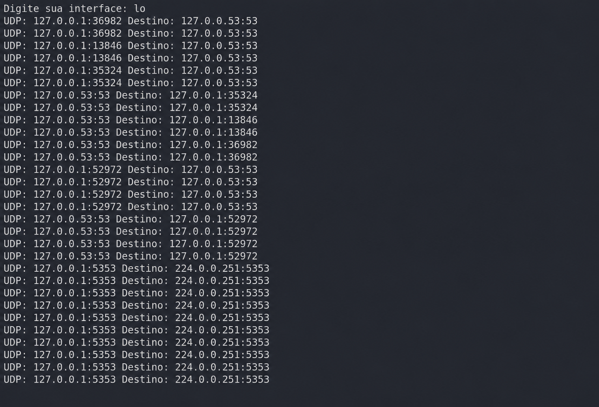

## Detecão-de-Intrusos

Desenvolvimento de uma ferramenta de monitoramento de rede inspirada em Sistemas de Detecção de Intrusão Baseados em Rede (NIDS), capaz de capturar e analisar pacotes TCP e UDP em tempo real. O projeto inclui funcionalidades de inspeção de tráfego, geração de alertas e detecção de possíveis ataques DoS e DDoS.

## Instalação
1. Clone este repositório.
2. Crie um ambiente virtual: `python3 -m venv venv && source venv/bin/activate`
3. Instale as dependências: `pip install -r requirements.txt`
4. Execute: `python3 ndis.py`

## Licença

Este projeto está licenciado sob a Licença MIT. Você tem permissão para utilizar, copiar, modificar, distribuir e sublicenciar este software, desde que o aviso de direitos autorais e a licença original sejam mantidos.

Este software é fornecido "como está", sem qualquer garantia expressa ou implícita. Os autores não se responsabilizam por quaisquer danos, prejuízos ou consequências decorrentes do uso deste software.

O uso desta ferramenta deve estar em conformidade com as leis e regulamentações aplicáveis. O autor não se responsabiliza por usos indevidos, ilegais ou não autorizados realizados por terceiros.

Consulte o arquivo LICENSE para o texto completo da Licença MIT.
